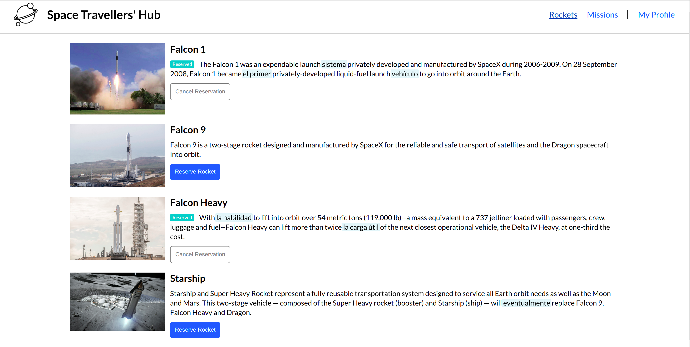
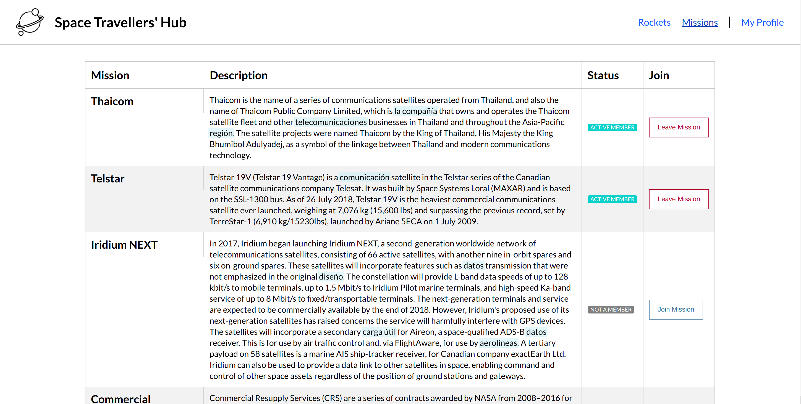
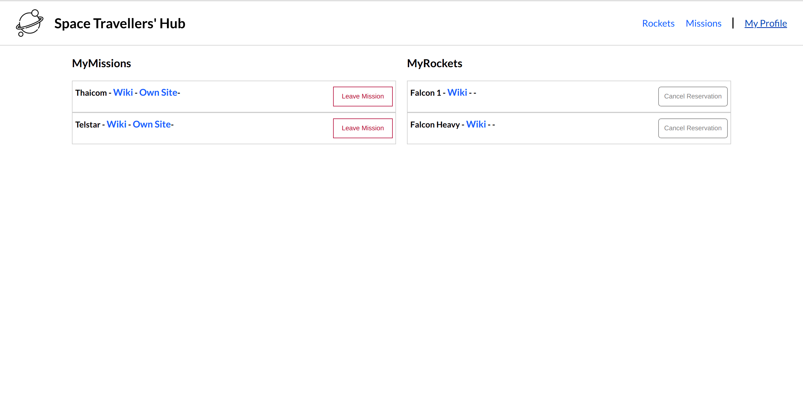

# Space Travellers' Hub

> This application works with real live data from the SpaceX API. It was build for a company that provides commercial and scientific space travel services.   It allows users to book rockets and join selected space missions.

It was build for a company that provides commercial and scientific space travel services. The Rockets section displays a list of all available SpaceX rockets. Users can book each rocket by clicking the reservation button or cancel the previously made booking. The Missions section displays a list of current missions along with their brief description and participation status. There is also a button next to each mission that allows users to join the selected mission or leave the mission the user joined earlier.

## Built With

- Major languages: JavaScript, HTML & CSS;
- Frameworks: React;
- Technologies used: Redux, GitHub, GitFlow, Terminal;

## Live Demo

[Live Demo Link](https://space-travellers-hub-react-redux.netlify.app/)

## Getting Started

### Prerequisites

- Please make sure you have Node.js packedge installed on your terminal.

### Setup

To get a local copy up and running follow these simple steps.

To setup the bookstore project in your local, in the repo page:
click on code (dropdown list) > Download as ZIP;
or open terminal of path you want to install project and run this command  
`git clone git@github.com:nicupop729/space-travelers-hub.git`.

### Install

Run in your terminal the following commands:

**`$ cd space-travellers-hub/`** 
**`$ npm install`** 
**`$ npm start`**

## Author

👤 **Nicolae Pop**

- GitHub: [@nicupop729](https://github.com/nicupop729)
- Twitter: [@nicupop729](https://twitter.com/nicupop729)
- LinkedIn: [LinkedIn](https://www.linkedin.com/in/nicolae-pop/)

👤 **Chibuike Uzoechina**

- GitHub: [@Chike1990](https://github.com/Chike1990)
- Twitter: [@ChibuikeUzoechi](https://twitter.com/ChibuikeUzoechi)
- LinkedIn: [@Chibuike-Uzoechina](https://www.linkedin.com/in/chibuike-uzoechina-630857102)

## 🤝 Contributing

Contributions, issues, and feature requests are welcome!

Feel free to check the [issues page](https://github.com/nicupop729/space-travellers-hub/issues).

## Show your support

Give a ⭐️ if you like this project!

## Acknowledgments

This is a project done during React module at **[Microverse](https://www.microverse.org/)**, a remote web-developer school, using their support and frameworks provided. 

## 📝 License

This project is [MIT](./MIT.md) licensed.
